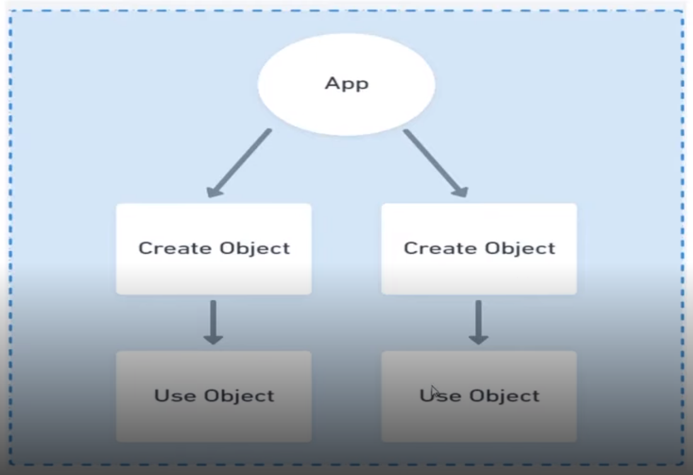
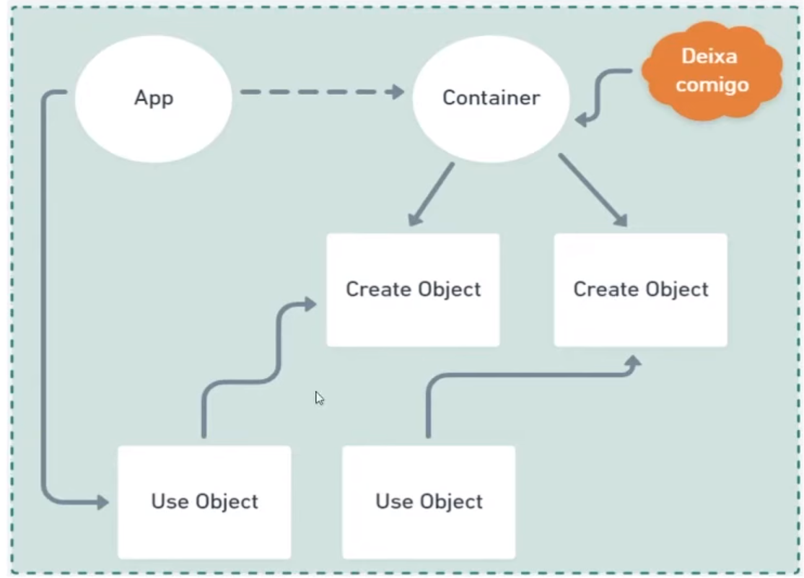

Esse repositório tem como objetivo guardar os códigos dos projetos que desenvolvo para estudar assim como algumas anotações

IoC: Inversion of control

Fluxo sem IoC:

Fluxo com IoC:

Injeção de dependências:

