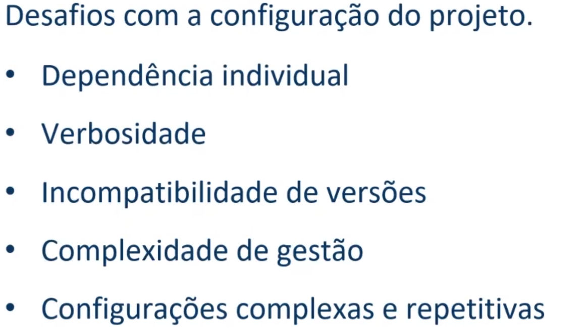
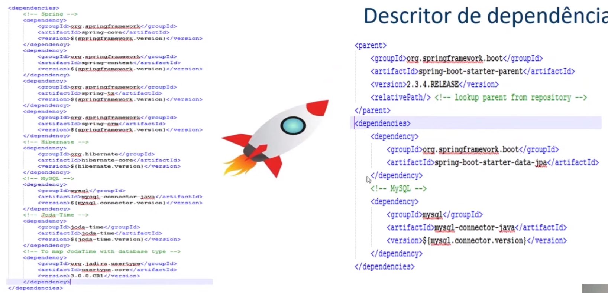
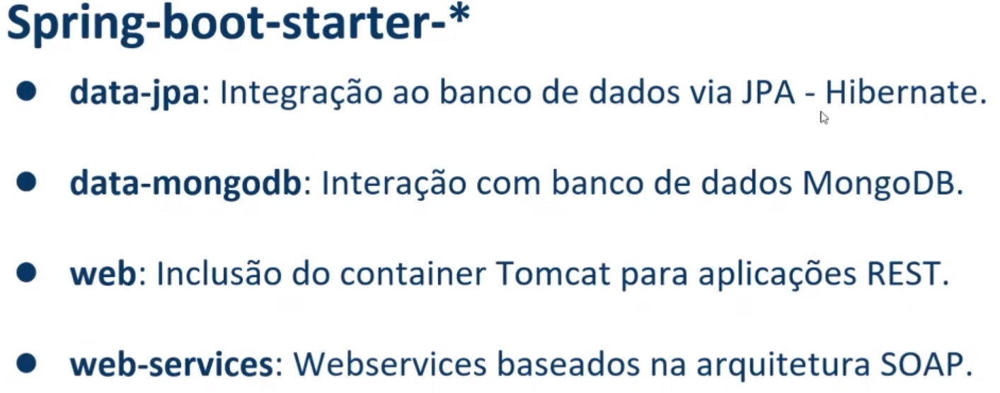
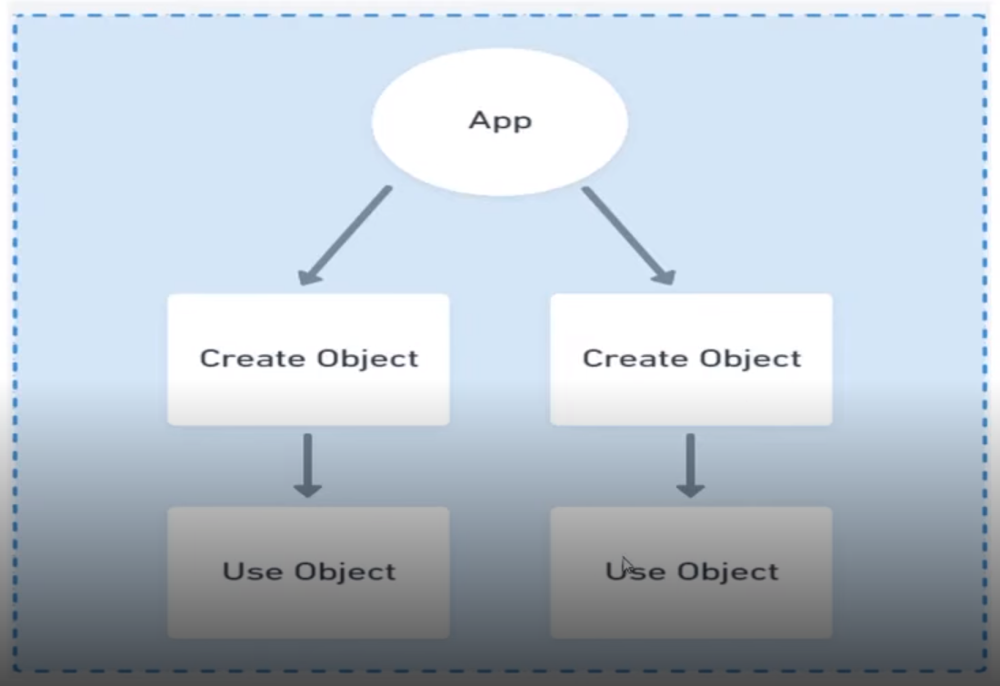
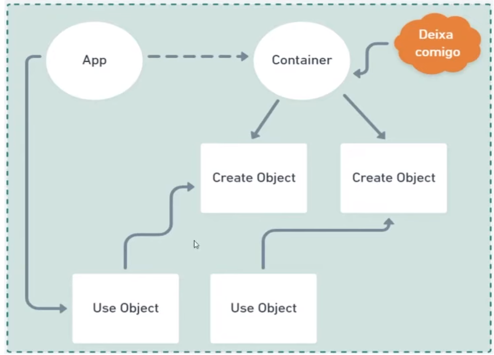
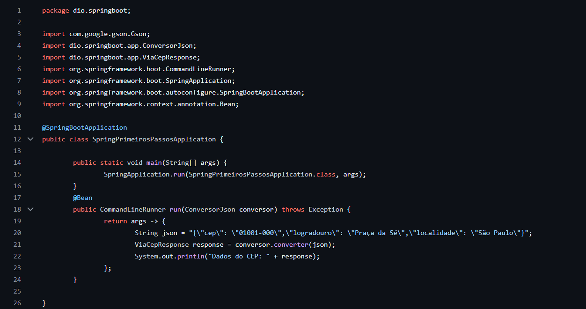
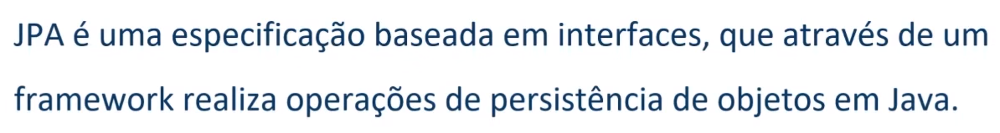
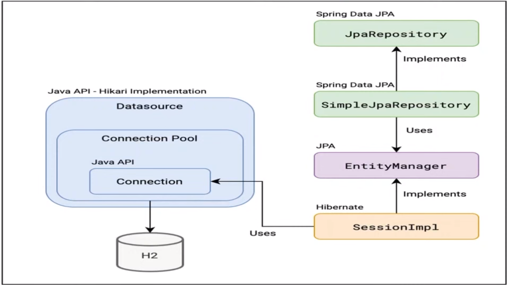
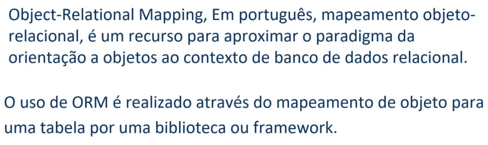
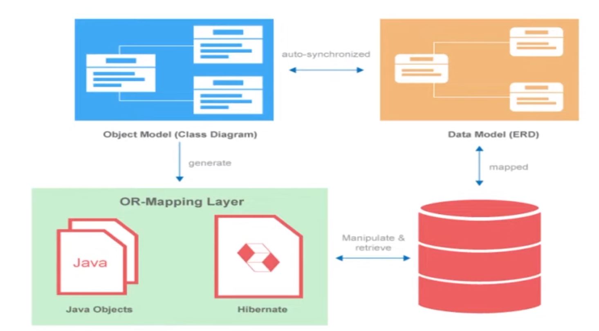

# Contexto
Esse repositório tem como objetivo guardar os códigos dos projetos que 
desenvolvo para estudar assim como algumas anotações

# Temas

## Spring Framework

## Spring Boot

### Antes do Spring Boot

A proposta do Spring Boot é que, como muitas aplicações sempre precisam passar 
pelos mesmos processos iniciais para 
serem iniciadas, poderia automatizar essa etapa. Assim foram criados os starters: (Descritores de Dependências)

## IoC: Inversion of control

## Fluxo sem IoC:

## Fluxo com IoC:

## 

## Injeção de dependências:

# Bean vs Component

Utilizamos component quando temos acesso ao código fonte 
e Bean quando não temos mas precisamos injetar essa dependencia
no projeto. Seria possível colocar o Bean dentro da classe principal da aplicação,
mas isso polui a classe:

# Prototype vs Singleton

Prototype: A cada necessidade da 
aplicação existirá uma instancia da dependencia utilizada

Singleton: Existirá uma unica instancia da dependencia 
utilizada 

# JPA

 

# ORM

