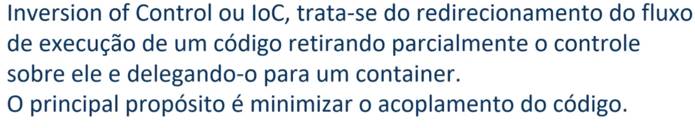

# Contexto
Esse repositório tem como objetivo guardar os códigos dos projetos que 
desenvolvo para estudar assim como algumas anotações

# Temas

## Spring Framework

## Spring Boot

### Antes do Spring Boot

A proposta do Spring Boot é que, como muitas aplicações sempre precisam passar 
pelos mesmos processos iniciais para 
serem iniciadas, poderia automatizar essa etapa. Assim foram criados os starters: (Descritores de Dependências)

## IoC: Inversion of control

## Fluxo sem IoC:

## Fluxo com IoC:

## 

## Injeção de dependências:

# Iniciando um projeto

1. Criar o projeto: https://start.spring.io